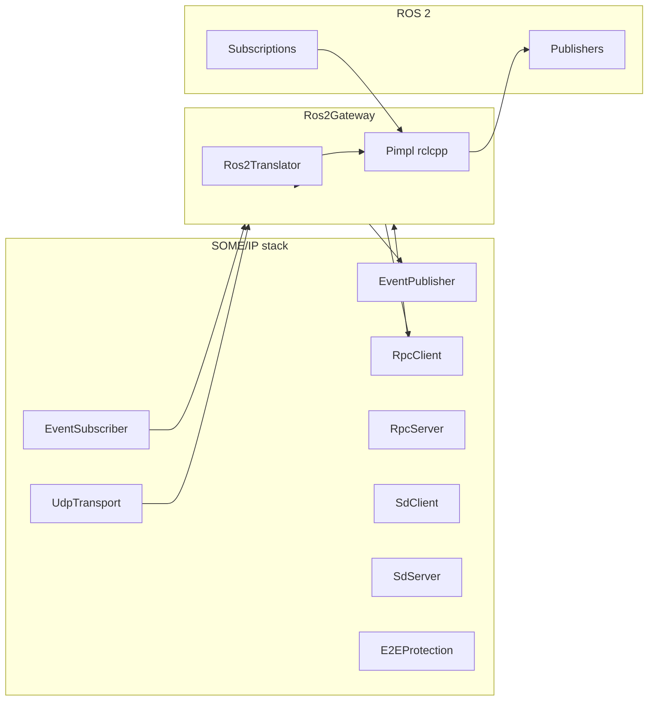

# SOME/IP ↔ ROS 2 gateway

Bridge between OpenSOME/IP and ROS 2 using the shared `opensomeip-gateway-common` types (`GatewayBase`, `ServiceMapping`, `MessageTranslator`, statistics, and direction enums).

## Architecture



- **SOME/IP → ROS 2:** `on_someip_message()` resolves `ServiceMapping`, optionally validates E2E, converts payload with `Ros2Translator`, then publishes via rclcpp (`std_msgs/msg/UInt8MultiArray`) or a test callback when ROS is not linked. Default ROS topic shape is `{namespace}/{topic_prefix}/{service_hex}/{instance_hex}/event/{event_hex}` unless `external_identifier` overrides it.
- **ROS 2 → SOME/IP:** ROS subscriptions (when rclcpp is enabled) call `inject_ros2_message()`, which builds a SOME/IP request and dispatches it through `RpcClient` or the optional `someip_outbound_sink`.

## Features

- `Ros2Config` for node name, ROS namespace, SOME/IP bind address/port, RPC client ID, SD configs, E2E, and feature flags.
- Optional **rclcpp** / **std_msgs**: if both are found at configure time, `OPENSOMEIP_GATEWAY_ROS2_HAS_RCLCPP` is defined and the pimpl creates nodes, publishers, and subscriptions.
- Integrates **EventPublisher**, **EventSubscriber**, **RpcClient**, **RpcServer**, **SdClient**, **SdServer**, **UdpTransport**, and **E2EProtection** from OpenSOME/IP.

## ROS 2 APIs used (when enabled)

- `rclcpp::init` / `rclcpp::shutdown`
- `rclcpp::Node`
- `rclcpp::Publisher` / `create_publisher` for `std_msgs/msg/UInt8MultiArray`
- `rclcpp::Subscription` / `create_subscription` for command topics derived from `ServiceMapping::external_identifier`
- QoS derived from `Ros2Translator::qos_for_someip_transport()`

## OpenSOME/IP APIs used

- `someip::Message`, `MessageId`, `RequestId`, `MessageType`, `ReturnCode`
- `someip::serialization::Serializer` / `Deserializer` (see example)
- `someip::events::EventPublisher`, `EventSubscriber`
- `someip::rpc::RpcClient`, `RpcServer`
- `someip::sd::SdClient`, `SdServer`
- `someip::transport::UdpTransport`, `Endpoint`
- `someip::e2e::E2EProtection`, `E2EConfig`
- `someip::Result`

## Build

From the `opensomeip-gateways` tree (with `../some-ip` or an installed `opensomeip`):

```bash
cmake -S . -B build -DBUILD_GATEWAY_ROS2=ON -DBUILD_TESTS=ON
cmake --build build
ctest --test-dir build -R Ros2Gateway --output-on-failure
```

With ROS 2 sourced so `find_package(rclcpp)` and `find_package(std_msgs)` succeed, the library links ROS, defines `OPENSOMEIP_GATEWAY_ROS2_HAS_RCLCPP`, and builds `ros2_adas_bridge` when `-DBUILD_EXAMPLES=ON`.

## QoS mapping (SOME/IP transport hint → ROS profile)

| SOME/IP hint (`SomeipTransportKind`) | Reliable | History depth | Durability notes        |
|--------------------------------------|----------|---------------|-------------------------|
| `UDP_UNICAST`                        | no       | 5             | volatile                |
| `UDP_MULTICAST`                      | no       | 5             | volatile                |
| `TCP`                                | yes      | 10            | volatile                |

Adjust `Ros2Config::default_someip_transport` to match how events are delivered on the vehicle bus.

## Example usage

See `examples/ros2_adas_bridge.cpp` and `examples/ros2_config.yaml`. The example serializes float speed/steering with `someip::serialization::Serializer`, feeds `Ros2Gateway::on_someip_message()` for SOME/IP-side simulation, and runs a small ROS publisher loop.

Register mappings with `external_identifier` set to the target ROS topic name. Use `GatewayDirection::SOMEIP_TO_EXTERNAL` for telemetry and `EXTERNAL_TO_SOMEIP` (or `BIDIRECTIONAL`) for commands.
